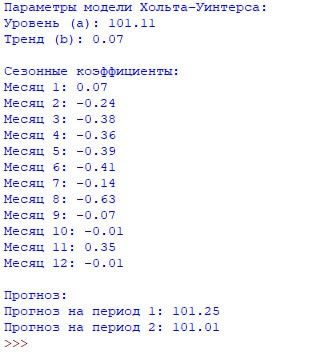

# Прогнозирование индекса потребительских цен на товары и услуги по Российской Федерации в 2023-2024 году методом Хольта–Уинтерса

## Цель работы
Целью данной работы является реализация модели тройного экспоненциального сглаживания Хольта–Уинтерса для анализа и прогнозирования временного ряда с выраженной сезонностью и трендом на основе статистических данных.

## Постановка задачи
В рамках работы необходимо:
- считать временной ряд из CSV-файла;
- реализовать модель Хольта–Уинтерса с аддитивной сезонностью;
- определить параметры уровня, тренда и сезонных компонентов;
- выполнить краткосрочный прогноз;
- проанализировать полученные результаты.

## Краткое описание модели
Модель Хольта–Уинтерса — это метод прогнозирования временных рядов, учитывающий:
- уровень (level) — текущее среднее значение ряда;
- тренд (trend) — направление изменения данных;
- сезонность (seasonality) — периодические колебания.

В данной работе используется аддитивная сезонная модель, применимая для временных рядов с постоянной амплитудой сезонных колебаний.

## Математическая модель

Обозначения:
- $y_t$ — фактическое значение временного ряда;
- $a_t$ — уровень ряда;
- $b_t$ — тренд;
- $s_t$ — сезонная компонента;
- $m$ — длина сезона (12 месяцев);
- $\alpha_1, \alpha_2, \alpha_3 \in (0,1)$ — коэффициенты сглаживания.

---

## Исходный код программы
Полная реализация модели находится в отдельном файле:

👉 **[Код программы](./LB6.py)**

## Результаты работы программы

### Параметры модели Хольта–Уинтерса
- Уровень (a): 101.11
- Тренд (b): 0.07

### Сезонные коэффициенты

| Месяц | Значение |
|------:|---------:|
| 1 | 0.07 |
| 2 | -0.24 |
| 3 | -0.38 |
| 4 | -0.36 |
| 5 |-0.39 |
| 6 | -0.41 |
| 7 | -0.14 |
| 8 | -0.63 |
| 9 | -0.07 |
| 10 | -0.01 |
| 11 | 0.35 |
| 12 | -0.01 |

### Прогноз
- Прогноз на период 1: 101.25
- Прогноз на период 2: 101.01

## Экраны / скриншоты работы программы

## Вывод
В ходе выполнения работы была реализована модель Хольта–Уинтерса, позволяющая учитывать тренд и сезонность временного ряда. Полученная модель обеспечивает корректный краткосрочный прогноз и может быть использована для анализа экономических показателей.
