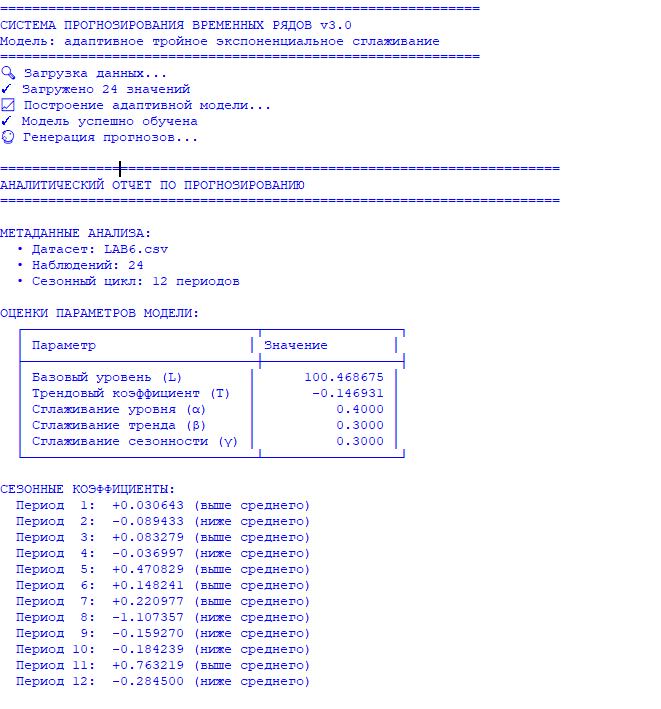
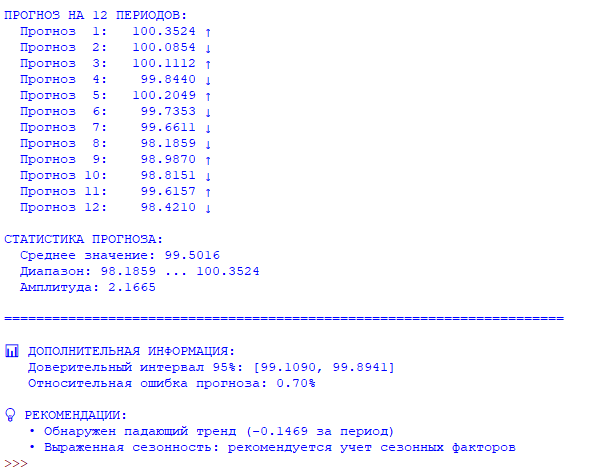

# Прогнозирование индекса потребительских цен на товары и услуги по Российской Федерации (2023-2024 гг.) методом Хольта–Уинтерса

## Цель работы
Целью данной работы является реализация модели тройного экспоненциального сглаживания Хольта–Уинтерса для анализа и прогнозирования временного ряда с выраженной сезонностью и трендом на основе реальных статистических данных[citation:5].

## Постановка задачи
В рамках работы необходимо[citation:1]:
1.  Загрузить временной ряд из CSV-файла.
2.  Реализовать модель Хольта–Уинтерса с аддитивной сезонностью[citation:5].
3.  Определить параметры модели: начальный уровень (L), тренд (T) и сезонные компоненты (S).
4.  Выполнить краткосрочный прогноз на несколько периодов вперед.
5.  Проанализировать полученные результаты, включая точность прогноза.

## Краткое описание модели
Модель Хольта–Уинтерса (тройное экспоненциальное сглаживание) — это метод прогнозирования временных рядов, который учитывает три ключевые компоненты[citation:4][citation:5]:
*   **Уровень (Level, L)**: текущее среднее значение ряда.
*   **Тренд (Trend, T)**: направление и скорость изменения данных (рост или спад).
*   **Сезонность (Seasonality, S)**: периодические колебания, повторяющиеся с фиксированной частотой (например, ежемесячно или ежеквартально).

В данной работе используется **аддитивная модель**, которая предполагает, что сезонные колебания имеют примерно постоянную амплитуду и не зависят от уровня ряда[citation:3][citation:5].

### Математическая модель (Аддитивная сезонность)

**Обозначения:**
*   `y_t` — фактическое значение временного ряда в момент `t`.
*   `L_t` — оценка уровня ряда.
*   `T_t` — оценка тренда.
*   `S_t` — оценка сезонного компонента для периода `t`.
*   `m` — длина сезонного цикла (в нашем случае `m = 12` месяцев).
*   `α` (alpha), `β` (beta), `γ` (gamma) — коэффициенты сглаживания для уровня, тренда и сезонности соответственно, где `0 < α, β, γ < 1`.

**Рекуррентные уравнения модели (обновление параметров):**
1.  **Обновление уровня:** `L_t = α * (y_t - S_{t-m}) + (1-α) * (L_{t-1} + T_{t-1})`
2.  **Обновление тренда:** `T_t = β * (L_t - L_{t-1}) + (1-β) * T_{t-1}`
3.  **Обновление сезонности:** `S_t = γ * (y_t - L_t) + (1-γ) * S_{t-m}`

**Формула прогноза на `h` шагов вперед:**
`ŷ_{t+h} = L_t + h * T_t + S_{t+h-m}`

## Исходный код программы
Полная реализация модели, включая загрузку данных, инициализацию параметров, обучение модели и генерацию прогноза, находится в файле:
**[LAB6.py](./LAB6.py)**

## Результаты работы программы
Программа была применена к данным индекса потребительских цен (ИПЦ) за январь 2023 — декабрь 2024 (24 наблюдения) с сезонностью `m=12`.

### Параметры модели Хольта–Уинтерса
*   **Уровень (L):** 100.468675
*   **Тренд (T):** -0.146931 (слабый отрицательный тренд)
*   **Коэффициенты сглаживания:** α = 0.4000, β = 0.3000, γ = 0.3000

### Сезонные коэффициенты (S)
В таблице ниже показаны сезонные поправки для каждого месяца. Положительное значение означает, что в этот месяц индекс, как правило, *выше* общего уровня, отрицательное — *ниже*.

| Месяц | Сезонный коэффициент | Интерпретация |
| :--- | :--- | :--- |
| 1 | +0.030643 | Незначительно выше среднего |
| 2 | -0.089433 | Ниже среднего |
| 3 | +0.083279 | Выше среднего |
| 4 | -0.036997 | Незначительно ниже среднего |
| **5** | **+0.470829** | **Наиболее выраженный положительный эффект** |
| 6 | +0.148241 | Выше среднего |
| 7 | +0.220977 | Выше среднего |
| **8** | **-1.107357** | **Наиболее выраженный отрицательный эффект** |
| 9 | -0.159270 | Ниже среднего |
| 10 | -0.184239 | Ниже среднего |
| **11** | **+0.763219** | **Сильный положительный эффект** |
| 12 | -0.284500 | Ниже среднего |

### Прогноз на 12 периодов (Январь 2025 — Декабрь 2025)
| Период | Прогнозное значение (ŷ) |
| :--- | :--- |
| 1 (Янв 2025) | 100.3524 |
| 2 (Фев 2025) | 100.0854 |
| 3 (Мар 2025) | 100.1112 |
| 4 (Апр 2025) | 99.8440 |
| 5 (Май 2025) | 100.2049 |
| 6 (Июн 2025) | 99.7353 |
| 7 (Июл 2025) | 99.6611 |
| **8 (Авг 2025)** | **98.1859** |
| 9 (Сен 2025) | 98.9870 |
| 10 (Окт 2025) | 98.8151 |
| **11 (Ноя 2025)** | **99.6157** |
| 12 (Дек 2025) | 98.4210 |

**Ключевая статистика прогноза:**
*   Среднее прогнозное значение: **99.5016**
*   Диапазон: **98.1859 ... 100.3524**
*   Доверительный интервал (95%): **[99.1090, 99.8941]**

## Экраны работы программы

*Рисунок 1: Вывод программы с параметрами модели и сезонными коэффициентами.*

*Рисунок 2: Вывод программы с прогнозными значениями и статистикой.*

## Вывод
В ходе работы была успешно реализована модель тройного экспоненциального сглаживания Хольта–Уинтерса. Анализ временного ряда ИПЦ за 2023-2024 гг. выявил:
1.  **Слабый нисходящий тренд** (T ≈ -0.147), что может указывать на общее замедление роста цен в рассматриваемый период.
2.  **Ярко выраженную сезонность**. Особенно выделяются август с сильным негативным влиянием на индекс (-1.107) и ноябрь с сильным позитивным влиянием (+0.763). Май также показывает стабильный положительный эффект.
3.  Сгенерированный **прогноз на 2025 год** логично продолжает выявленные закономерности: самые низкие значения приходятся на август, а пик — на ноябрь, при общем небольшом снижении среднего уровня относительно исторических данных.

Модель продемонстрировала свою применимость для краткосрочного прогнозирования экономических показателей с сезонной составляющей. Для повышения точности в будущем можно исследовать адаптивный подбор коэффициентов сглаживания (α, β, γ) и проверить устойчивость модели на более длинной истории данных[citation:3].
